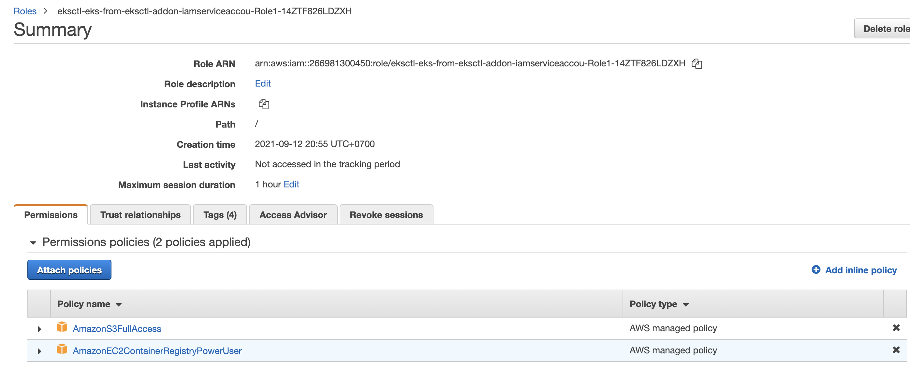
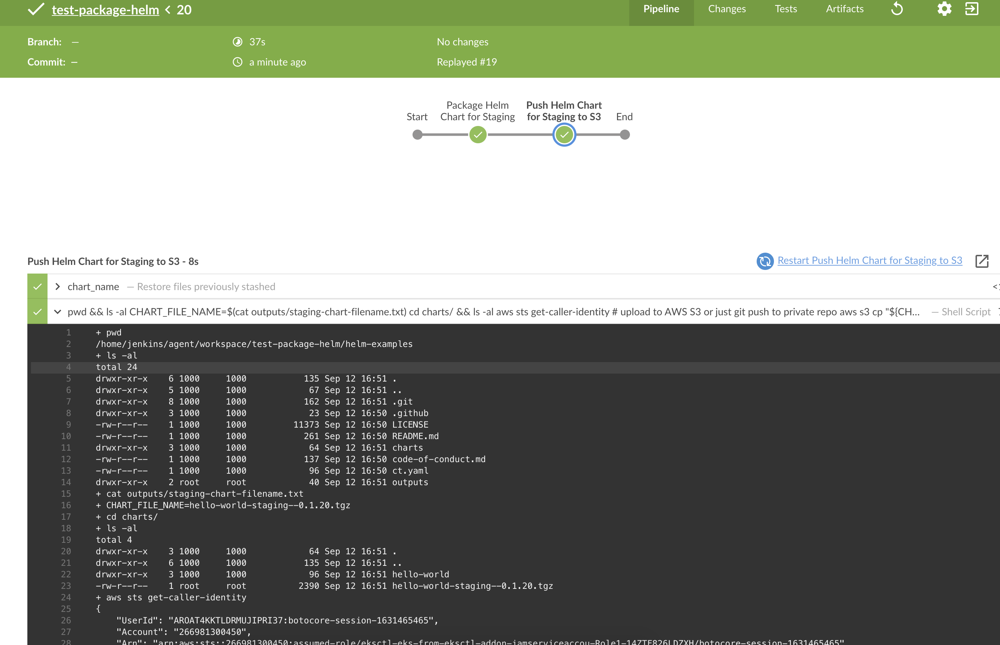

# 10. How to Package Helm Chart and Upload it to S3 Bucket 

Just like the step to build a docker image, let's think about what CLIs are needed to deploy new K8s pod using Helm chart
```sh
# overwrite image tag in Helm's values.yaml using sed command
sed "s/tag:.*/tag: ${short_branch_name}_0.1.$BUILD_NUMBER/g" -i values.yaml

# also update Chart.yaml
sed "s/version:.*/version: 0.1.$BUILD_NUMBER/g" -i Chart.yaml
sed "s/appVersion:.*/appVersion: ${APP_VERSION}/g" -i Chart.yaml
sed "s/branch:.*/branch: ${BRANCH_NAME}/g" -i Chart.yaml
sed "s/commitID:.*/commitID: ${gitCommit}/g" -i Chart.yaml

cat Chart.yaml

# then validate helm chart is correct
helm lint

# package helm chart dir into an artifact (.zip etc)
helm package ${HELM_CHART_NAME}-${K8S_NAMESPACE_STAGING}/

# upload artifact to AWS S3
aws s3 cp "${CHART_FILE_NAME}" "${S3_BUCKET}${CHART_FILE_NAME}"

# run helm upgrade, instead of `kubectl apply -f ...yaml`
helm upgrade --atomic \
  --reset-values \
  ${HELM_CHART_NAME} ${HELM_CHART_NAME}-${K8S_NAMESPACE_STAGING}/ \
  -n ${K8S_NAMESPACE_STAGING}

# check history
helm history ${HELM_CHART_NAME} -n ${K8S_NAMESPACE_STAGING}

# test 
helm test ${HELM_CHART_NAME} -n ${K8S_NAMESPACE_STAGING}
```


These sequences can be broken into a few Jenkins `Stages`: 
- Package a Helm Chart
- Upload Helm Chart
- Deploy Helm Chart

And in terms of CLIs, we need:
- `helm`
- `aws` for copying a helm chart artifact to S3

So there is a public docker repo for helm image at `lachlanevenson/k8s-helm`. So we will pull this image and push it to our private ECR to avoid getting rate limiting and throttled by dockerhub (if you pull from pubic docker hub, and your Jenkins pipeline runs often, then you will eventually get `toomanyrequests error to docker hub` error).


```sh
docker pull lachlanevenson/k8s-helm

# change this to your own
ECR_REPO_URI="266981300450.dkr.ecr.ap-southeast-1.amazonaws.com/test-jenkins"
docker tag lachlanevenson/k8s-helm:latest ${ECR_REPO_URI}:lachlanevenson-k8s-helm

# get ECR password
ecr_password=$(aws ecr get-login-password --region ${AWS_REGION})

# login to ecr repo using docker login
echo ${ecr_password} | docker login \
                                  --username AWS \
                                  --password-stdin \
                                  ${ECR_REPO_URI}
# output
Login Succeeded

docker push ${ECR_REPO_URI}:lachlanevenson-k8s-helm
```


Then update Jenkinsfile by adding a `lachlanevenson-k8s-helm` docker image in Kubernetes agent yaml config:

[Jenkinsfile.push.helm.chart](Jenkinsfile.push.helm.chart):
```groovy
pipeline {
    agent {
        kubernetes {
            yaml '''
apiVersion: v1
kind: Pod  # <-------- pod where jenkins slave agent container (jnlp-slave) will be running
spec:
  serviceAccountName: jenkins # this is for IRSA (IAM role for service account)
  containers:
  - name: docker # <---------- docker client
    image: docker:19.03.1
    command:
    - sleep
    args:
    - 99d
    env:
      - name: DOCKER_HOST
        value: tcp://localhost:2375
  - name: docker-aws-cli 
    image: 266981300450.dkr.ecr.ap-southeast-1.amazonaws.com/test-jenkins:docker-aws 
    env:
      - name: DOCKER_HOST
        value: tcp://localhost:2375
  - name: helm  # <---------------------------------- add new docker image name
    image: 266981300450.dkr.ecr.ap-southeast-1.amazonaws.com/test-jenkins:lachlanevenson-k8s-helm # <---------- change this to your ECR URI
    stdin: true
    tty: true   
    command:
    - sleep   # <----------- so container doesn't terminate
    args:
    - 99d
    env:
      - name: DOCKER_HOST
        value: tcp://localhost:2375
  - name: docker-daemon
    image: docker:19.03.1-dind 
    securityContext:
      privileged: true
    env:
      - name: DOCKER_TLS_CERTDIR
        value: ""
'''
            defaultContainer 'docker'
        }
    }

} // pipeline
```

Then add `Package Helm Chart` Stage.

For demo purpose, we will use a simple example helm chart: https://github.com/helm/examples.

[Jenkisfile.push.helm.chart](Jenkisfile.push.helm.chart):
```groovy
pipeline {
  environment {
      ECR_REPO_URI = "266981300450.dkr.ecr.ap-southeast-1.amazonaws.com/test-jenkins"
      AWS_REGION = "ap-southeast-1"

      HELM_EXAMPLE_GIT_REPO = "https://github.com/helm/examples.git"
      HELM_CHART_NAME = "hello-world"

      K8S_NAMESPACE_STAGING = "staging"

      S3_BUCKET = "s3://s3-jenkins-artifacts-266981300450/helm-charts" // <----- change this to your account ID to avoid global name conflict
    }

    stages {
        stage('Package Helm Chart for Staging') {
          steps {
              // `dir` step will create folder in workspace, if it is not exist
              // checkout repo into subdir. Ref: https://newbedev.com/in-jenkins-how-to-checkout-a-project-into-a-specific-directory-using-git
              dir("helm-examples") {

                // clone a repo containing a sample helm chart
                git url: "${HELM_EXAMPLE_GIT_REPO}",
                    branch: "main" // some repo's primary branch is no longer "master", which is the default for git plugin. Ref: https://github.com/jenkinsci/gitlab-plugin/issues/539#issuecomment-774521662
              
                container('helm') {
                    sh '''
                        pwd && ls -al

                        cd charts/hello-world && ls -al

                        # get first 20 chars because k8s name should be no more than 63 characters
                        # prepend shortened branch name to image tag
                        short_branch_name=$(echo ${BRANCH_NAME} | cut -c1-20)
                        echo "short_branch_name in Package Helm Chart for Staging = ${short_branch_name}"

                        echo "Setting docker image tag version..."
                        grep "tag: " values.yaml

                        # replace characters matching from "tag:" till the rest of the line, with "tag: SHORT_BRANCH_NAME_BUILD_NUMBER"
                        sed "s/tag:.*/tag: 1.21.3/g" -i values.yaml  # <------ need to use existing Nginx image tag
                        grep "tag: " values.yaml
                          

                        echo "Setting Helm chart appVersion..."
                        grep "version:" Chart.yaml
                        grep "appVersion:" Chart.yaml

                        # replace characters matching from "appVersion:" till the rest of the line, with "version: BUILD_NUMBER"
                        # WARNING: helm chart "version" can't contain string but "appVersion" can (e.g. "[ERROR] Chart.yaml: version 'feature-update-newrelic-dep-0.1.2' is not a valid SemVer")
                        # ref: https://helm.sh/docs/topics/charts/#the-chartyaml-file
                        # ref: https://github.com/helm/helm/issues/3555#issuecomment-631576453
                        sed "s/version:.*/version: 0.1.${BUILD_NUMBER}/g" -i Chart.yaml
                        
                        APP_VERSION=${BRANCH_NAME}-0.1.${BUILD_NUMBER}
                        sed "s/appVersion:.*/appVersion: ${APP_VERSION}/g" -i Chart.yaml

                        cat Chart.yaml

                        helm lint

                        cd ../    # curr dir is helm-examples/charts/
                        helm package ${HELM_CHART_NAME}/

                        ls

                        # by default, helm package cmd will name archive with ${HELM_CHART_NAME}-$version. Rename it to be more descriptive
                        CHART_FILE_NAME=${HELM_CHART_NAME}-${K8S_NAMESPACE_STAGING}-${APP_VERSION}.tgz
                        mv ${HELM_CHART_NAME}-0.1.$BUILD_NUMBER.tgz ${CHART_FILE_NAME}

                        # QUIZ: why need to go one dir above before mkdir outputs?
                        cd ../  # curr dir is helm-examples/
                        mkdir -p outputs
                        echo ${CHART_FILE_NAME} >> outputs/staging-chart-filename.txt && cat outputs/staging-chart-filename.txt
                        ls -l outputs/
                    '''

                    // once outside of sh'', curr dir will be "helm-examples/"
                    sh 'pwd && ls -al'

                    // stash the dir so next stage{} block can access file
                    stash name: "chart_name", includes: "outputs/*" // this means there must be helm-examples/outputs
                } // container
              } // dir
          } // steps
        } // stage

        stage('Push Helm Chart for Staging to S3') {
            steps {
                // curr dir is /home/jenkins/agent/workspace/test-package-helm
                sh 'pwd && ls -al'
                unstash "chart_name"
                sh 'pwd && ls -al'

                dir("helm-examples") {
                    container('docker-aws-cli') {
                        sh '''
                            pwd && ls -al
                            CHART_FILE_NAME=$(cat outputs/staging-chart-filename.txt)

                            cd charts/ && ls -al

                            aws sts get-caller-identity

                            # upload to AWS S3 or just git push to private repo                           
                            aws s3 cp "${CHART_FILE_NAME}" "${S3_BUCKET}/${CHART_FILE_NAME}"
                        '''
                    } // container
                } // dir
            } // steps
        } // stage
    } // stages
} // pipeline
```


Create S3 bucket `s3-jenkins-artifacts-${ACCOUNT_ID}` manually from Console.

Also, manuall add S3 write permission to Jenkins-slave pod's IAM role we created earlier.







