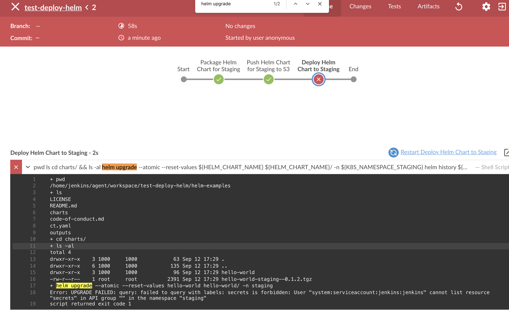
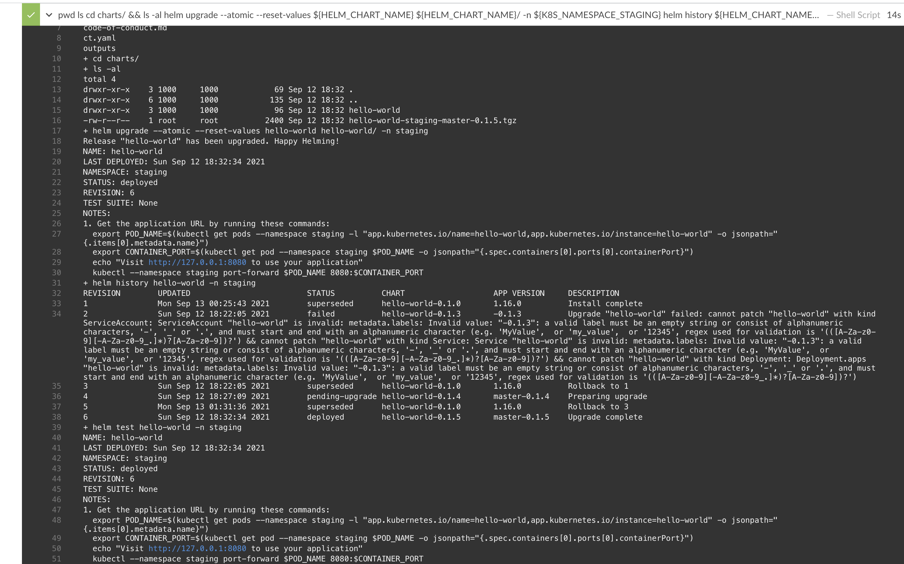

# 11. How to Deploy K8s Pods from inside Jenkins Slave Pod 

Let's add new stage `Deploy Helm Chart to Staging` to Jenkinsfile
```groovy
pipeline {
  stages {
    stage('Deploy Helm Chart to Staging') {
        steps {
            dir("${HELM_DIR}") {
                container('helm') {
                    sh '''
                        pwd
                        ls

                        helm upgrade --atomic --reset-values ${HELM_CHART_NAME} ${HELM_CHART_NAME}-${K8S_NAMESPACE_STAGING}/ -n ${K8S_NAMESPACE_STAGING}

                        helm history ${HELM_CHART_NAME} -n ${K8S_NAMESPACE_STAGING}

                        helm test ${HELM_CHART_NAME} -n ${K8S_NAMESPACE_STAGING}
                    '''
                } // container
            } // dir
        } // steps
    } // stage
  } // stages 
} // pipeline
```


Before running a pipeline, let's manually create K8s namespace `staging`

```sh
kubectl create ns staging
```

Then also install the sample helm chart beforehand
```sh
mkdir SAMPLE && cd SAMPLE
git clone https://github.com/helm/examples.git
cd examples/charts/

# this helm is really just nginx container
helm install hello-world  hello-world/ -n staging
```

Then run a pipeline using [Jenkinsfile.deploy.helm.chart](Jenkinsfile.deploy.helm.chart)




You will get something like
```log
Error: UPGRADE FAILED: query: failed to query with labels: secrets is forbidden: User "system:serviceaccount:jenkins:jenkins" cannot list resource "secrets" in API group "" in the namespace "staging"
```


This is because Jenkins-slave pod in K8s doesn't have K8s permissions to read secrets and create/upgrade pod/deployment etc.


To fix this, we need to associate __`jenkins` service accoun__ that's associated with `jenkins-slave` pod with new __ClusterRole__ which contains read & write for K8s objects such as pod, deployment, service, configmap, secret, etc.


## 11.2. How to give Jenkins-Slave pod access to K8s cluster

There are two scenarios:
1. Jenkins container running __inside__ K8s cluster you want to deploy to
2. Jenkins container running __outside__ K8s cluster you want to deploy to


## Scenario 1. (local cluster) Jenkins container running __inside__ K8s cluster you want to deploy to

Ref: [RBAC for Helm](https://helm.sh/docs/topics/rbac/)

Check current permissions that `jenkins` service account in `jenkins` namespace has
```
kubectl auth can-i create deploy \
        --as=system:serviceaccount:jenkins:jenkins \
        -n staging

kubectl auth can-i get pod \
        --as=system:serviceaccount:jenkins:jenkins \
        -n staging

kubectl auth can-i update secret \
        --as=system:serviceaccount:jenkins:jenkins \
        -n staging
```


Generate yaml file 
```sh
# bind ClusterRole "edit" to service account "jenkins" by creating ClusterRoleBinding
kubectl create clusterrolebinding jenkins \
        --clusterrole=edit \
        --serviceaccount=jenkins:jenkins \
        --dry-run=client -o yaml > clusterrolebinding_jenkins.yaml

kubectl apply -f clusterrolebinding_jenkins.yaml
```

Check permissions of `jenkins` service account in `jenkins` namespace

Ref: https://stackoverflow.com/a/54889459/1528958
```
kubectl auth can-i create deploy \
        --as=system:serviceaccount:jenkins:jenkins \
        -n staging

kubectl auth can-i get pod \
        --as=system:serviceaccount:jenkins:jenkins \
        -n staging

kubectl auth can-i update secret \
        --as=system:serviceaccount:jenkins:jenkins \
        -n staging
```


Run the pipeline using [Jenkinsfile.deploy.helm.chart](Jenkinsfile.deploy.helm.chart)


Check helm history
```sh
helm history hello-world -n staging
REVISION        UPDATED                         STATUS          CHART                   APP VERSION     DESCRIPTION
6               Sun Sep 12 18:32:34 2021        deployed        hello-world-0.1.5       master-0.1.5    Upgrade complete  
```


Check pod's image tag
```sh
$ k describe po -n staging hello-world-5ff785cbcd-krvgc

Name:         hello-world-5ff785cbcd-krvgc
Namespace:    staging
Priority:     0
Node:         ip-192-168-76-100.ap-southeast-1.compute.internal/192.168.76.100
Start Time:   Mon, 13 Sep 2021 01:32:35 +0700
Labels:       app.kubernetes.io/instance=hello-world
              app.kubernetes.io/name=hello-world
              pod-template-hash=5ff785cbcd
Annotations:  kubernetes.io/psp: eks.privileged
Status:       Running
IP:           192.168.86.248
IPs:
  IP:           192.168.86.248
Controlled By:  ReplicaSet/hello-world-5ff785cbcd
Containers:
  hello-world:
    Container ID:   docker://595dadf124f95d1fdecc2ec76d62ddc18f928f3f0038e3f6fe64727056fd9797
    Image:          nginx:1.21.3  # <--------- the one we set in Jenkinsfile
```




