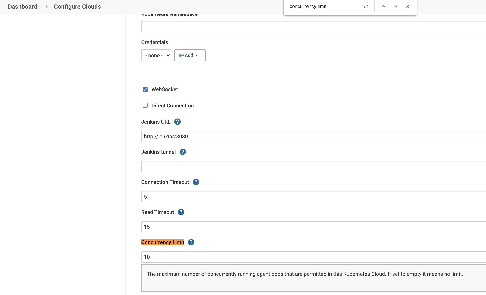

# 13. How to Limit Concurrent Jenkins Jobs

Manage Jenkins > Manage Nodes and Clouds > Configure Clouds > Kubernetes Cloud Details > Concurrency Limit

NOTE: using [Throttle Concurrent Builds Plugin](https://plugins.jenkins.io/throttle-concurrents/) didn't work for k8s.