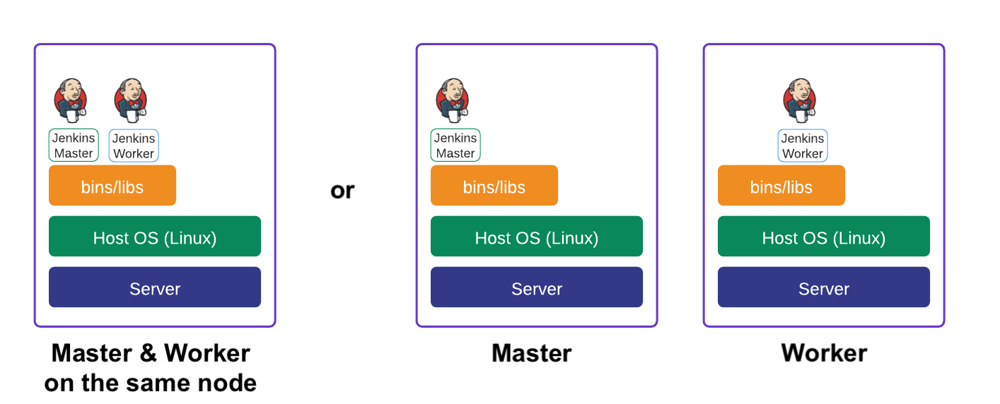
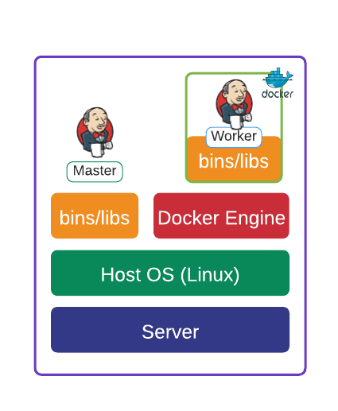
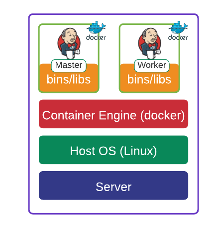
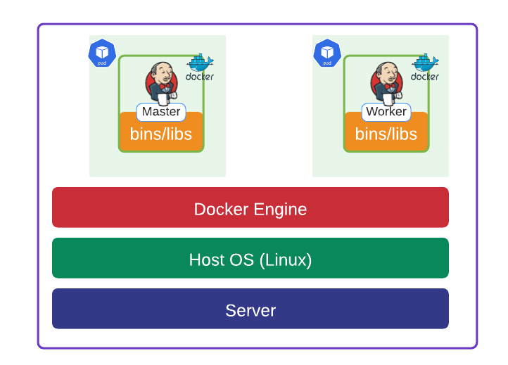

# 1. Why Installing Jenkins on K8s Cluster as a pod?

Ref: https://www.jenkins.io/doc/book/installing/kubernetes/

In the last chapter in Jenkins CI/CD Masterclass course, we covered these few possible architectures for Jenkins CI/CD:

1. Jenkins-master __process__ on a server & Jenkins-worker __process__ runs a job on the same or other servers

2. Jenkins-master __process__ on a server & Jenkins-worker __process__ runs a job inside container

3. Jenkins-master __container__ on a server & jenkins-worker __container__ runs a job on some containers inside a docker container (DinD: Docker in Docker)

4. Jenkins-master __container running inside K8s pod__ & jenkins-worker __container inside K8s pod__ runs a job inside a docker container (DinD: Docker in Docker)

The __benefits__ of using __Jenkins container inside K8s pod in deployment__:
- k8s manages and uses resources effectively (scheduling & deploying pods to under-loaded worker nodes)
- k8s deployment ensures that Jenkins pod is __highly available__ and __fault tolerant__ (if pod goes down, kubelet health check will detect it and notify API server, then controller manager will deploy a new pod) 

Compared those with __Jenkins process__ and __bare Jenkins container__:
- Jenkins process & docker container don't have __HA__ and __fault tolerant__ mechanism built in like K8s deployment
- Jenkins process & docker container don't have k8s controller-plane like intelligence to deploy a process or container to under-loaded server. Not effective at managing resource

So, given that the industry is moving toward docker and k8s (AWS EKS, GCP GKE, etc) for good reasons such as __environmet parity__ (apps run on the same environment inside the same docker container, no discrepancy in envs among OSs), why not deploy Jenkins in K8s cluster as well to take advantage of __HA and Fault Tolerancy__ it comes with?

You could still bake in Jenkins process in AWS __AMI__, then create AWS __Auto Scaling Group of size 1__ to make Jenkins server somewhat HA and fault tolerant, but you are still wasting resources on the Jenkins server. Also, jenkins worker agents/nodes are spinning up servers when they scale. Why not move to Jenkins worker pods so that they can utilize available resources on existing servers?

