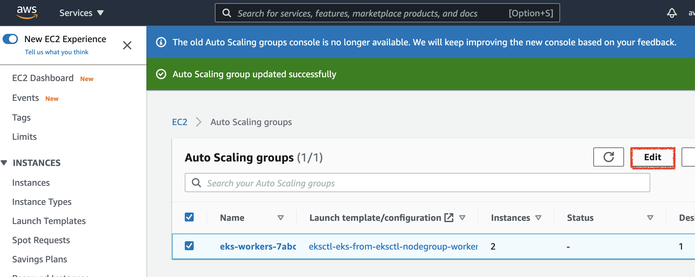
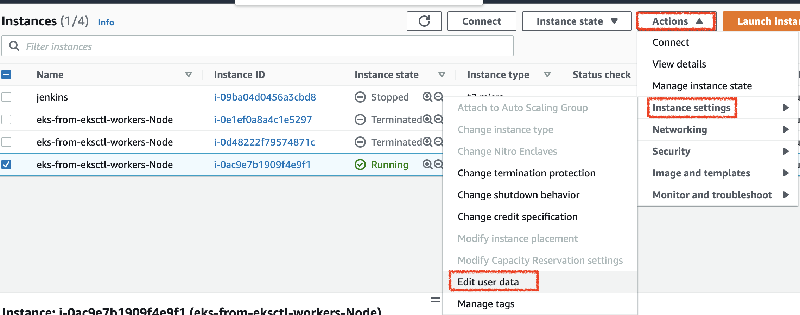

# 3. Create AWS EFS for Jenkins storage

Refs:

- <https://containerjournal.com/topics/container-networking/using-ebs-and-efs-as-persistent-volume-in-kubernetes/>
- <https://docs.aws.amazon.com/eks/latest/userguide/efs-csi.html>

## 3.1 EFS vs EBS for K8s Persistent Volume

We want to create a K8s __persistent volume__ (vs volume which is gone when pod is gone) for our Jenkins controller pod to prevent us from losing a whole configuration of the Jenkins controller and our jobs when __Jenkins controller pod restarts__.

However, __creating PV for Jenkins pod isn't enough__. PV will survive __pod restart__, but might _not_ K8s nodes restart, depending on a [type of PV you choose](https://kubernetes.io/docs/concepts/storage/persistent-volumes/#types-of-persistent-volumes).

Given that K8s worker nodes can scale out/in anytime and hence EBS can disappear as well, we should use storage solution that's independent of EC2, namely __AWS EFS__.

Here is comparison between EFS and EBS:

EFS:

- can be accessed from __multiple availability zones__ and it is the valuable for multi-AZ cluster
- EFS PV provides ReadWriteMany access mode
- EFS is a file system; hence, it won’t support some applications such as databases that require block storage
- EFS doesn’t support any backup mechanism we need to setup backup manually
- EFS doesn’t support snapshots
- EFS is built to elastically scale

EBS:

- EBS can be accessed by the host it is connected within __one zone__. EBS volume is automatically replicated within its Availability Zone to protect you from component failure, offering high availability and durability
- EBS PV provide only ReadWriteOnce access mode
- Can support all type of application
- Automatic scaling is not available in EBS but can scaled up down based on the need
- EBS on the other hand provides point-in-time snapshots of EBS volumes, which are backed up to Amazon S3 for long-term durability
- EBS provides the ability to copy snapshots across AWS regions, enabling geographical expansion, data center migration, and disaster recovery providing flexibility and protecting for your business

__To recap__,

Using __EC2's EBS__ for PV is __pod-restart proof__, but:

- when EC2 is gone (e.g. ASG scale in/out or EC2 failure), EBS is also gone (by default. Can still retain it and attach it to new EC2 but there will be __downtime__ for manual config)
- since __EBS is zonal__, if Jenkins pod moves to a new EC2 in different AZ, storage can't be ported over easily

Benefits of using __NFS (AWS EFS)__ for PV over __EC2's EBS__:

- EFS lifecycle outlives EC2's
- EFS is __regional__, so even if Jenkins pod moves to a new node in different AZ, the new EC2 can still mount the same EFS and share the storage (__no downtime__)

So we will use K8s PV with AWS EFS instead of default EBS.

## 3.2 Create EFS and EFS SG from Terraform (in my `Advanced Terraform with AWS EKS and VPC` course) or manually from Console

Ref: <https://docs.aws.amazon.com/eks/latest/userguide/efs-csi.html#efs-create-filesystem>

```sh
# set region to yours
AWS_REGION="ap-southeast-3"

# Retrieve the VPC ID that your cluster is in
vpc_id=$(aws eks describe-cluster \
    --name eks-from-eksctl \
    --query "cluster.resourcesVpcConfig.vpcId" \
    --region ${AWS_REGION} \
    --output text)
echo ${vpc_id}


# Retrieve the CIDR range for your cluster's VPC
cidr_range=$(aws ec2 describe-vpcs \
    --vpc-ids $vpc_id \
    --query "Vpcs[].CidrBlock" \
    --region ${AWS_REGION} \
    --output text)
echo ${cidr_range}


# Create EFS security group inside the VPC
security_group_id=$(aws ec2 create-security-group \
    --group-name EfsSecurityGroup \
    --description "EFS security group" \
    --vpc-id ${vpc_id} \
    --region ${AWS_REGION} \
    --output text)
echo ${security_group_id}   


# create SG rule for NFS. EFS SG must specify VPC CIDR as source CIDR
aws ec2 authorize-security-group-ingress \
    --group-id ${security_group_id} \
    --protocol tcp \
    --port 2049 \
    --region ${AWS_REGION} \
    --cidr ${cidr_range}


# Create an Amazon EFS file system 
file_system_id=$(aws efs create-file-system \
    --region ${AWS_REGION} \
    --performance-mode generalPurpose \
    --query 'FileSystemId' \
    --region ${AWS_REGION} \
    --output text)
echo ${file_system_id}


# get private subnets' IDs
aws ec2 describe-subnets \
    --filters "Name=vpc-id,Values=${vpc_id}" \
    --query 'Subnets[*].{SubnetId: SubnetId,AvailabilityZone: AvailabilityZone,CidrBlock: CidrBlock}' \
    --region ${AWS_REGION} \
    --output table


# set public subnet IDs (WARNING: only for demo, as EKS worker node is in public subnet. Should have been in private subnet) to yours here
subnets=("subnet-0a7fd3264f290a970" "subnet-0d43fb317ee524af2"  "subnet-0bb066af8343283a5")
echo ${subnets[@]}

# create EFS mount targets for public subnets (WARNING: only for demo, as EKS worker node is in public subnet. Should have been in private subnet) that EKS worker nodes are in
for subnet in "${subnets[@]}"; do
  aws efs create-mount-target \
      --file-system-id ${file_system_id} \
      --subnet-id ${subnet} \
      --security-groups ${security_group_id} \
      --region ${AWS_REGION} 
done

# successful outputs
{
    "OwnerId": "266981300450",
    "MountTargetId": "fsmt-f9205eb8",
    "FileSystemId": "fs-0e5b1ab9644f3466b",
    "SubnetId": "subnet-0facd6d85882c13a8",
    "LifeCycleState": "creating",
    "IpAddress": "192.168.145.35",
    "NetworkInterfaceId": "eni-00c2d729ae9c7b70f",
    "AvailabilityZoneId": "apse1-az3",
    "AvailabilityZoneName": "ap-southeast-1c",
    "VpcId": "vpc-081f83f675c97c381"
}
{
    "OwnerId": "266981300450",
    "MountTargetId": "fsmt-f8205eb9",
    "FileSystemId": "fs-0e5b1ab9644f3466b",
    "SubnetId": "subnet-0cb09e26fc1b1f0c5",
    "LifeCycleState": "creating",
    "IpAddress": "192.168.110.45",
    "NetworkInterfaceId": "eni-0e9a470b0e1b42be1",
    "AvailabilityZoneId": "apse1-az1",
    "AvailabilityZoneName": "ap-southeast-1b",
    "VpcId": "vpc-081f83f675c97c381"
}
{
    "OwnerId": "266981300450",
    "MountTargetId": "fsmt-fb205eba",
    "FileSystemId": "fs-0e5b1ab9644f3466b",
    "SubnetId": "subnet-033515a0193e46835",
    "LifeCycleState": "creating",
    "IpAddress": "192.168.163.83",
    "NetworkInterfaceId": "eni-05d7c23356e61b6c0",
    "AvailabilityZoneId": "apse1-az2",
    "AvailabilityZoneName": "ap-southeast-1a",
    "VpcId": "vpc-081f83f675c97c381"
}
```

Check EFS mount targets are created per private subnet:


## 3.3 Create IAM Role for K8s Service Account (IRSA) for EFS CSI Driver

Refs:

- <https://docs.aws.amazon.com/eks/latest/userguide/efs-csi.html#efs-create-iam-resources>
- <https://github.com/kubernetes-sigs/aws-efs-csi-driver/issues/392#issuecomment-848907054>

The driver requires IAM permission to talk to AWS EFS to manage the volume on user's behalf.

Otherwise, when you try to create PVC, you will get this error

```
$ kubectl describe pvc -n kube-system efs-claim

Dynamic provisioning error. Says AccessDenied: Not authorized to perform sts:AssumeRoleWithWebIdentity
```

There are several methods to grant driver IAM permission:

- Using IAM Role for Service Account (Recommended if you're using EKS): create an IAM Role for service accounts with the required permissions. Uncomment annotations and put the IAM role ARN in service-account manifest
- Using IAM instance profile - grant all the worker nodes with required permissions by attaching policy to the instance profile of the worker.

We'll choose IRSA approach using CLI.

```sh
curl -o eks_efs_csi_driver_iam_policy.json https://raw.githubusercontent.com/kubernetes-sigs/aws-efs-csi-driver/v1.3.2/docs/iam-policy-example.json

# create IAM policy first
aws iam create-policy \
    --policy-name EKS_EFS_CSI_Driver_Policy \
    --policy-document file://eks_efs_csi_driver_iam_policy.json

# output
{
    "Policy": {
        "PolicyName": "EKS_EFS_CSI_Driver_Policy",
        "PolicyId": "ANPAT4KKTLDRCFWIGM5OG",
        "Arn": "arn:aws:iam::266981300450:policy/EKS_EFS_CSI_Driver_Policy",
        "Path": "/",
        "DefaultVersionId": "v1",
        "AttachmentCount": 0,
        "PermissionsBoundaryUsageCount": 0,
        "IsAttachable": true,
        "CreateDate": "2021-09-11T13:34:31+00:00",
        "UpdateDate": "2021-09-11T13:34:31+00:00"
    }
}
```

Then create service account and IAM role

```sh
# set region to yours
AWS_REGION="ap-southeast-3"
ACCOUNT_ID=572372482934

# associate IAM OIDC provider with cluster
eksctl utils associate-iam-oidc-provider \
  --region=${AWS_REGION} \
  --cluster=${CLUSTER_NAME} \
  --approve

# output
2021-09-11 20:42:00 [✔]  created IAM Open ID Connect provider for cluster "eks-from-eksctl" in "ap-southeast-1"


# create k8s service account and IAM role
eksctl create iamserviceaccount \
    --name efs-csi-controller-sa \
    --namespace kube-system \
    --cluster ${CLUSTER_NAME} \
    --attach-policy-arn arn:aws:iam::${ACCOUNT_ID}:policy/EKS_EFS_CSI_Driver_Policy \
    --approve \
    --override-existing-serviceaccounts \
    --region ${AWS_REGION}

# output
2021-09-11 20:43:21 [ℹ]  created serviceaccount "kube-system/efs-csi-controller-sa"
```

Check IAM role created:


## 3.4 Deploy AWS EFS CSI (container storage interface) driver

Refs:

- <https://docs.aws.amazon.com/eks/latest/userguide/efs-csi.html#efs-install-driver>
- <https://github.com/kubernetes-sigs/aws-efs-csi-driver>

> EFS CSI provides a CSI interface that allows Kubernetes clusters running on AWS to manage the lifecycle of Amazon EFS file systems.

Basically, it's an interface between K8s PV & PVC and AWS EFS.

There are [two ways to install it](https://github.com/kubernetes-sigs/aws-efs-csi-driver#installation):

- AWS EFS CSI Driver Helm Chart
- yaml file (<https://kubernetes-sigs.github.io/aws-efs-csi-driver/>)

Install Helm chart

```sh
helm repo add aws-efs-csi-driver https://kubernetes-sigs.github.io/aws-efs-csi-driver/

helm repo update

# you can pull helm chart to lock in the version
helm pull aws-efs-csi-driver/aws-efs-csi-driver


# WARNING: change image repo URI based on your region from here: https://docs.aws.amazon.com/eks/latest/userguide/add-ons-images.html
helm install aws-efs-csi-driver aws-efs-csi-driver/aws-efs-csi-driver \
    --namespace kube-system \
    --set image.repository=602401143452.dkr.ecr.ap-southeast-1.amazonaws.com/eks/aws-efs-csi-driver \
    --set controller.serviceAccount.create=false  # override this to false as we created it manually

# output 
NAME: aws-efs-csi-driver
LAST DEPLOYED: Sat Sep 11 20:46:23 2021
NAMESPACE: kube-system
STATUS: deployed
REVISION: 1
TEST SUITE: None
NOTES:
To verify that aws-efs-csi-driver has started, run:

    kubectl get pod -n kube-system -l "app.kubernetes.io/name=aws-efs-csi-driver,app.kubernetes.io/instance=aws-efs-csi-driver"
```

## 3.5 Mount EFS to EKS worker node using fstab from userdata bootstrap script (in my `Advanced Terraform with AWS EKS and VPC` course) or manually from shell

This portion should be added to worker node's userdata script in .tfvars file.

Note: userdata script doesn't resolve shell variable defined within

```sh
sudo su

# set values to your own
export file_system_id="fs-0e5b1ab9644f3466b"
export AWS_REGION="ap-southeast-3"

mkdir /mnt/efs

# for this mounting to work, EFS should be attached to EFS SG with inbound NFS protocol
mount -t nfs -o nfsvers=4.1,rsize=1048576,wsize=1048576,hard,timeo=600,retrans=2,noresvport ${file_system_id}.efs.${AWS_REGION}.amazonaws.com:/ /mnt/efs

echo "${file_system_id}.efs.${AWS_REGION}.amazonaws.com:/ /mnt/efs nfs defaults,vers=4.1 0 0" >> /etc/fstab

df -h

# output
Filesystem                                      Size  Used Avail Use% Mounted on
devtmpfs                                        3.9G     0  3.9G   0% /dev
tmpfs                                           3.9G     0  3.9G   0% /dev/shm
tmpfs                                           3.9G  1.3M  3.9G   1% /run
tmpfs                                           3.9G     0  3.9G   0% /sys/fs/cgroup
/dev/nvme0n1p1                                   80G  4.4G   76G   6% /
tmpfs                                           786M     0  786M   0% /run/user/1000
fs-0e5b1ab9644f3466b.efs.ap-southeast-1.amazonaws.com:/  8.0E     0  8.0E   0% /mnt/efs
```

Also update existing AWS Launch Template's userdata script so that new EKS worker nodes will run the bootstrap script to auto-mount EFS


```sh
MIME-Version: 1.0
Content-Type: multipart/mixed; boundary="//"

--//
Content-Type: text/x-shellscript; charset="us-ascii"
#!/bin/bash
set -ex
B64_CLUSTER_CA=xyz==
API_SERVER_URL=https://864E4B20969F9E54A143625B9E0E2FFA.gr7.ap-southeast-1.eks.amazonaws.com
K8S_CLUSTER_DNS_IP=10.100.0.10
/etc/eks/bootstrap.sh eks-from-eksctl --kubelet-extra-args '--node-labels=eks.amazonaws.com/sourceLaunchTemplateVersion=1,alpha.eksctl.io/cluster-name=eks-from-eksctl,alpha.eksctl.io/nodegroup-name=workers,eks.amazonaws.com/nodegroup-image=ami-016e739e57ea162d9,eks.amazonaws.com/capacityType=ON_DEMAND,eks.amazonaws.com/nodegroup=workers,eks.amazonaws.com/sourceLaunchTemplateId=lt-0f89e0aea00ddc7f4' --b64-cluster-ca $B64_CLUSTER_CA --apiserver-endpoint $API_SERVER_URL --dns-cluster-ip $K8S_CLUSTER_DNS_IP

# ADD YOUR CUSTOM EFS-RELATED SCRIPT AT THE BOTTOM
mkdir /mnt/efs
mount -t nfs -o nfsvers=4.1,rsize=1048576,wsize=1048576,hard,timeo=600,retrans=2,noresvport fs-0e5b1ab9644f3466b.efs.ap-southeast-3.amazonaws.com:/ /mnt/efs
echo "fs-0e5b1ab9644f3466b.efs.ap-southeast-3.amazonaws.com:/ /mnt/efs nfs defaults,vers=4.1 0 0" >> /etc/fstab

--//--
```

After that, edit existing ASG to reference the latest version of the launch template:




Then terminate EKS worker node so that a new node with the updated ASG & Launch template with userdata will spin up.

Check userdata section of the new EC2:



SSH into the server and check if EFS is auto-mounted

```sh
$ ssh -A ec2-user@PUBLIC_IP_EC2

Last login: Mon Aug 30 21:06:52 2021 from 205.251.233.51

       __|  __|_  )
       _|  (     /   Amazon Linux 2 AMI
      ___|\___|___|


[ec2-user@ip-192-168-57-148 ~]$ df -h
Filesystem                                      Size  Used Avail Use% Mounted on
devtmpfs                                        3.9G     0  3.9G   0% /dev
tmpfs                                           3.9G     0  3.9G   0% /dev/shm
tmpfs                                           3.9G  304K  3.9G   1% /run
tmpfs                                           3.9G     0  3.9G   0% /sys/fs/cgroup
/dev/nvme0n1p1                                   20G  1.9G   19G  10% /
fs-0e5b1ab9644f3466b.efs.ap-southeast-1.amazonaws.com:/  8.0E  388M  8.0E   1% /mnt/efs # <------- EFS mounted!
tmpfs                                           786M     0  786M   0% /run/user/1000
```

## 3.6 Test with sample apps

Create k8s storageclass, persistent volume claim, and pod.

```sh

$ kubectl apply -f dynamic_provisioning_storageclass.yaml

# output
$ kubectl get sc
NAME            PROVISIONER             RECLAIMPOLICY   VOLUMEBINDINGMODE      ALLOWVOLUMEEXPANSION   AGE
efs-sc          efs.csi.aws.com         Delete          Immediate              false                  3s
gp2 (default)   kubernetes.io/aws-ebs   Delete          WaitForFirstConsumer   false                  74m


$ kubectl apply -f test_efs_pod.yaml 
persistentvolumeclaim/efs-claim created
pod/efs-app created

# make sure PVC is successfully bound. If you didn't create IAM role for service account for efs-csi-driver, then the driver would've failed to create storage space in EFS
$ kubectl get pvc
NAME        STATUS   VOLUME                                     CAPACITY   ACCESS MODES   STORAGECLASS   AGE
efs-claim   Bound    pvc-684d6200-24f6-4d3f-843b-02e38bc51490   5Gi        RWX            efs-sc         4s

$ kubectl get po
NAME      READY   STATUS    RESTARTS   AGE
efs-app   1/1     Running   0          3m11s


$ kubectl exec -ti efs-app -- tail -f /data/out
# outputs
Sat Sep 11 13:50:40 UTC 2021
Sat Sep 11 13:50:45 UTC 2021
Sat Sep 11 13:50:50 UTC 2021
Sat Sep 11 13:50:55 UTC 2021
Sat Sep 11 13:51:00 UTC 2021
Sat Sep 11 13:51:05 UTC 2021
Sat Sep 11 13:51:10 UTC 2021
Sat Sep 11 13:51:15 UTC 2021
Sat Sep 11 13:51:20 UTC 2021
```

Check if `/data/out` is actually stored on EFS mount point (`/mnt/efs`)

```sh
ssh -A ec2-user@PUBLIC_IP_EKS_WORKER_NODE

[ec2-user@ip-192-168-65-222 ~]$ cat /mnt/efs/dynamic_provisioning/pvc-684d6200-24f6-4d3f-843b-02e38bc51490/out 
Sat Sep 11 13:48:20 UTC 2021
Sat Sep 11 13:48:25 UTC 2021
Sat Sep 11 13:48:30 UTC 2021
Sat Sep 11 13:48:35 UTC 2021
Sat Sep 11 13:48:40 UTC 2021
```

Delete a test app

```sh
k delete -f test_efs_pod.yaml 
```
