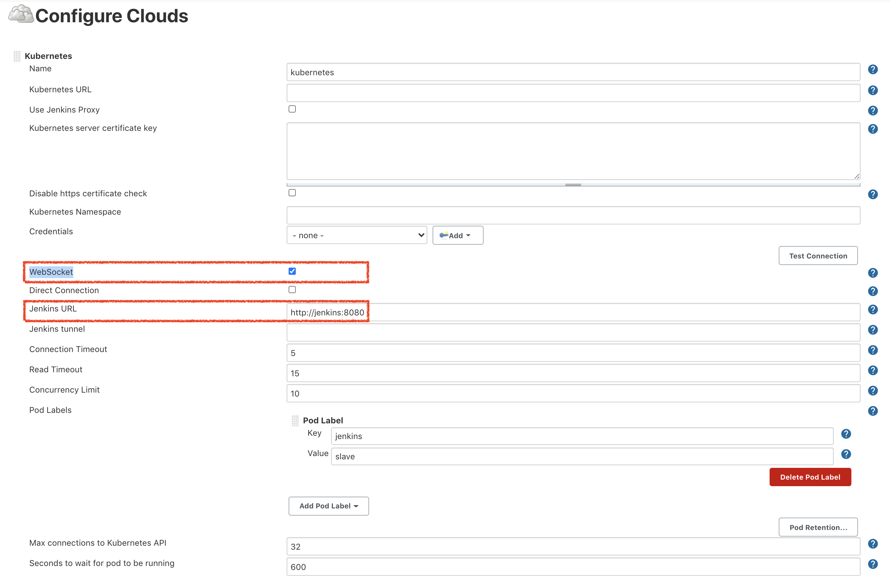
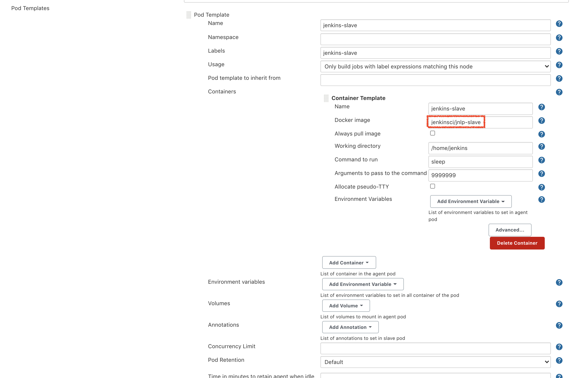
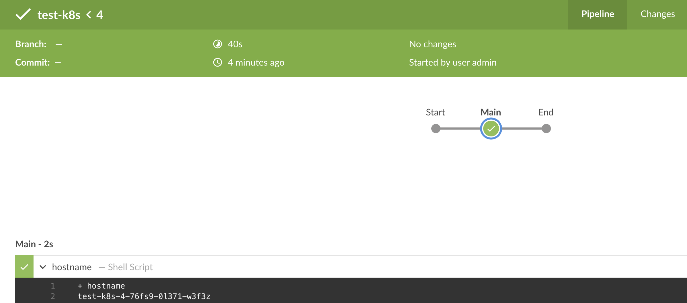

# 7. How to Run a Job in a Jenkins Slave Agent as k8s Pod

## 7.1 Install Jenkins Kubernetes plugin.

```sh
kubectl --namespace jenkins port-forward svc/jenkins 8080:8080
```

Then access `localhost:8080` from browser.


## 7.2 Go to `Manage Jenkins` > `Manage Nodes and Cloud` > `Configure Cloud` > add Kuberentes config

Refs:
- https://plugins.jenkins.io/kubernetes/
- https://github.com/jenkinsci/kubernetes-plugin#configuration


Make sure to check off "Web Socket" otherwise "provided port:50000 is not reachable" error (Ref: https://github.com/helm/charts/issues/7360#issuecomment-730142810)





Note: you don't need to set ENVs for JENKINS_HOME and JENKINS_TUNNEL as mentioned in other articles:
- https://stackoverflow.com/questions/58719522/tcpslaveagentlistener-is-invalid-404-not-found


## 7.3. Configure Jekninsfile for Pipeline
Refs:
- https://www.jenkins.io/doc/book/pipeline/syntax/#agent-parameters
- https://github.com/jenkinsci/kubernetes-plugin/blob/master/examples/kaniko-declarative.groovy
- https://github.com/jenkinsci/kubernetes-plugin#declarative-pipeline


```groovy
// ref: jenkins k8s plugin: https://plugins.jenkins.io/kubernetes/
// sample: https://github.com/jenkinsci/kubernetes-plugin/pull/707/commits/13f5d176cad3c3767298f92f372780d2252717f8#diff-75c25710c8943fb46d7720a84a7a7472R4-R31
pipeline {
    agent {
        kubernetes { // <-------- agent value [any, none, docker, kubernetes]
            // Rather than inline YAML, in a multibranch Pipeline you could use: yamlFile 'jenkins-pod.yaml'
            yaml '''
apiVersion: v1
kind: Pod
spec:
  containers:
  - name: shell
    image: ubuntu
    command:
    - sleep
    args:
    - infinity
'''
            defaultContainer 'shell'
        }
    }
    stages {
        stage('Main') {
            steps { // this step will run inside ubuntu pod defined at the agent {}
                sh 'hostname'
            }
        }
    }
}
```

Notice the difference with normal Jenkinsfile
```sh
pipeline {
  agent any # <--------

  stages {}
}
```
or docker agent

```sh
pipeline {
  agent {
    docker { # <--------
      image 'node:14-alpine' 
    }
  }

  stages {}
}
```


Create a pipeline and build a job. See if `jenkins-slave` pod shows up in `jenkins` namespace.

```sh
NAME                           READY   STATUS              RESTARTS   AGE
jenkins-0                      2/2     Running             0          47m
test-k8s-4-76fs9-0l371-w3f3z   0/2     ContainerCreating   0          14s # <------ jenkins worker pod
```




However, you might see `Failed to connect to jenkins:8080/tcpSlaveAgentListener/: Connection refused (Connection refused)` error:
```sh
$ kubectl logs jenkins-slave-zprx7-f88vg -f -n jenkins -c jnlp
```

```log
Jun 12, 2020 10:01:52 AM hudson.remoting.jnlp.Main createEngine
INFO: Setting up agent: jenkins-slave-zprx7-f88vg
Jun 12, 2020 10:01:52 AM hudson.remoting.jnlp.Main$CuiListener <init>
INFO: Jenkins agent is running in headless mode.
Jun 12, 2020 10:01:52 AM hudson.remoting.Engine startEngine
INFO: Using Remoting version: 4.0.1
Jun 12, 2020 10:01:52 AM org.jenkinsci.remoting.engine.WorkDirManager initializeWorkDir
INFO: Using /home/jenkins/agent/remoting as a remoting work directory
Jun 12, 2020 10:01:52 AM org.jenkinsci.remoting.engine.WorkDirManager setupLogging
INFO: Both error and output logs will be printed to /home/jenkins/agent/remoting
Jun 12, 2020 10:01:52 AM hudson.remoting.jnlp.Main$CuiListener status
INFO: Locating server among [http://internal-xxx-xxx.us-east-1.elb.amazonaws.com/]
Jun 12, 2020 10:01:52 AM hudson.remoting.jnlp.Main$CuiListener error
SEVERE: Failed to connect to http://internal-xxx-xxx.us-east-1.elb.amazonaws.com/tcpSlaveAgentListener/: Connection refused (Connection refused)
java.io.IOException: Failed to connect to http://internal-xxx-xxx.us-east-1.elb.amazonaws.com/tcpSlaveAgentListener/: Connection refused (Connection refused) # <----- error
        at org.jenkinsci.remoting.engine.JnlpAgentEndpointResolver.resolve(JnlpAgentEndpointResolver.java:217)
        at hudson.remoting.Engine.innerRun(Engine.java:690)
        at hudson.remoting.Engine.run(Engine.java:518)
Caused by: java.net.ConnectException: Connection refused (Connection refused)
        at java.net.PlainSocketImpl.socketConnect(Native Method)
        at java.net.AbstractPlainSocketImpl.doConnect(AbstractPlainSocketImpl.java:350)
        at java.net.AbstractPlainSocketImpl.connectToAddress(AbstractPlainSocketImpl.java:206)
        at java.net.AbstractPlainSocketImpl.connect(AbstractPlainSocketImpl.java:188)
        at java.net.SocksSocketImpl.connect(SocksSocketImpl.java:392)
        at java.net.Socket.connect(Socket.java:607)
        at sun.net.NetworkClient.doConnect(NetworkClient.java:175)
        at sun.net.www.http.HttpClient.openServer(HttpClient.java:463)
        at sun.net.www.http.HttpClient.openServer(HttpClient.java:558)
        at sun.net.www.http.HttpClient.<init>(HttpClient.java:242)
        at sun.net.www.http.HttpClient.New(HttpClient.java:339)
        at sun.net.www.http.HttpClient.New(HttpClient.java:357)
        at sun.net.www.protocol.http.HttpURLConnection.getNewHttpClient(HttpURLConnection.java:1226)
        at sun.net.www.protocol.http.HttpURLConnection.plainConnect0(HttpURLConnection.java:1162)
        at sun.net.www.protocol.http.HttpURLConnection.plainConnect(HttpURLConnection.java:1056)
        at sun.net.www.protocol.http.HttpURLConnection.connect(HttpURLConnection.java:990)
        at org.jenkinsci.remoting.engine.JnlpAgentEndpointResolver.resolve(JnlpAgentEndpointResolver.java:214)
        ... 2 more
```

But `/tcpSlaveAgentListener` returns 200
```
$ curl http://JENKINS_PUBLIC_ENDPOINT/tcpSlaveAgentListener/ -v

*   Trying 10.1.103.202...
* TCP_NODELAY set
* Connected to JENKINS_PUBLIC_ENDPOINT (10.1.103.202) port 80 (#0)
> GET /tcpSlaveAgentListener/ HTTP/1.1
> Host: JENKINS_PUBLIC_ENDPOINT
> User-Agent: curl/7.54.0
> Accept: */*
> 
< HTTP/1.1 200 OK
< date: Fri, 12 Jun 2020 11:50:37 GMT
< x-content-type-options: nosniff
< content-type: text/plain;charset=utf-8
< x-hudson-jnlp-port: 50000
< x-jenkins-jnlp-port: 50000
< x-instance-identity: MIIBIjANBgkqhkiG9w0BAQEFAAOCAQ8AMIIBCgKCAQEAuSNmwO+JEpFTaJvuIb5o8+gr311aFqAfRV8Hh97mJHZmGBqG7kGJf74tc6hr5cREVRD+vw8giqaUzyvALu4GomUVJFpo0PzCXaRjphRIjkdhis7oZ8utdtCl9CdNGr9yXVZq4hp+znCm3Rg9XNlJ1u8pWLGihk4vz+2phkXBQ0rOCk203L8KuQ8CeEgbSvSQHwtyiSUixAVO1AVZ0uWBNqBdzwKu6GuaAqAU1lUErJrxKk+NVqZJ5KiOAMnbVbsEwAou3ySIBZPeSsALsez/y2BKJfJD8gdvqRmVp6GNsYXU56IbsM9s8WyAmVwP85h52Svl8sSr3UsbNEOcZsy5VwIDAQAB
< x-jenkins-agent-protocols: JNLP4-connect, Ping
< x-remoting-minimum-version: 3.14
< content-length: 12
< server: istio-envoy
< x-envoy-upstream-service-time: 2
< 

  Jenkins
```

If __istio sidecar injection__ is enabled, jenkins slave can't connect to jenkins master with the following error:
```log
$ k logs -n jenkins -c jnlp

Jan 22, 2021 5:03:58 PM hudson.remoting.jnlp.Main createEngine
Jan 22, 2021 5:03:58 PM hudson.remoting.jnlp.Main$CuiListener <init>
INFO: Jenkins agent is running in headless mode.
Jan 22, 2021 5:03:58 PM hudson.remoting.Engine startEngine
INFO: Using Remoting version: 4.3
Jan 22, 2021 5:03:58 PM org.jenkinsci.remoting.engine.WorkDirManager initializeWorkDir
INFO: Using /home/jenkins/agent/remoting as a remoting work directory
Jan 22, 2021 5:03:58 PM org.jenkinsci.remoting.engine.WorkDirManager setupLogging
INFO: Both error and output logs will be printed to /home/jenkins/agent/remoting
Jan 22, 2021 5:03:58 PM hudson.remoting.jnlp.Main$CuiListener status
INFO: Locating server among [http://jenkins:8080/]
Jan 22, 2021 5:03:58 PM hudson.remoting.jnlp.Main$CuiListener error
SEVERE: Connection reset
java.net.SocketException: Connection reset
        at java.net.SocketInputStream.read(SocketInputStream.java:210)
        at java.net.SocketInputStream.read(SocketInputStream.java:141)
        at java.io.BufferedInputStream.fill(BufferedInputStream.java:246)
        at java.io.BufferedInputStream.read1(BufferedInputStream.java:286)
        at java.io.BufferedInputStream.read(BufferedInputStream.java:345)
        at sun.net.www.http.HttpClient.parseHTTPHeader(HttpClient.java:735)
        at sun.net.www.http.HttpClient.parseHTTP(HttpClient.java:678)
        at sun.net.www.http.HttpClient.parseHTTP(HttpClient.java:706)
        at sun.net.www.protocol.http.HttpURLConnection.getInputStream0(HttpURLConnection.java:1593)
        at sun.net.www.protocol.http.HttpURLConnection.getInputStream(HttpURLConnection.java:1498)
        at java.net.HttpURLConnection.getResponseCode(HttpURLConnection.java:480)
        at org.jenkinsci.remoting.engine.JnlpAgentEndpointResolver.resolve(JnlpAgentEndpointResolver.java:220)
        at hudson.remoting.Engine.innerRun(Engine.java:693)
        at hudson.remoting.Engine.run(Engine.java:518)
```


If this happens, make sure to disable istio sidecar injection in `jenkins` namespace by running 
```sh
# disable sidecar 
kubectl label namespace jenkins istio-injection-
```

You can check if the annotation is present by
```sh
kubectl describe namespace jenkins

# expected
Name:         jenkins
Labels:       <none>
Annotations:  <none> # <----- no annotations expected if sidecar injection is disabled
Status:       Active

No resource quota.

No LimitRange resource.
```
