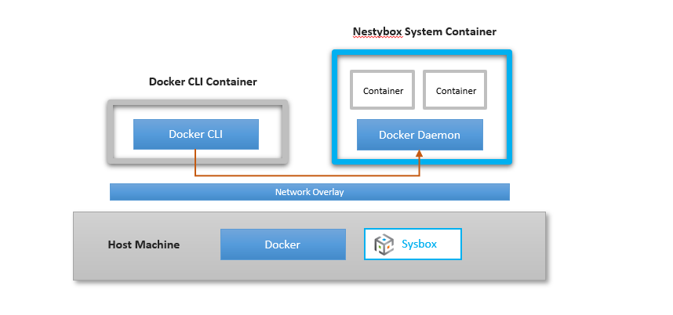
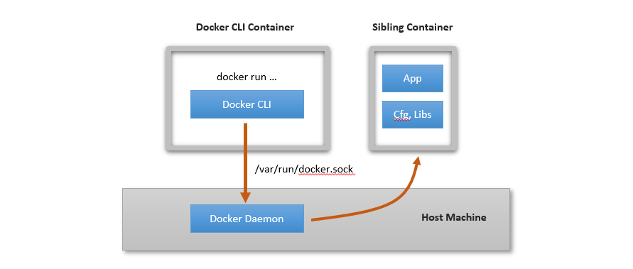
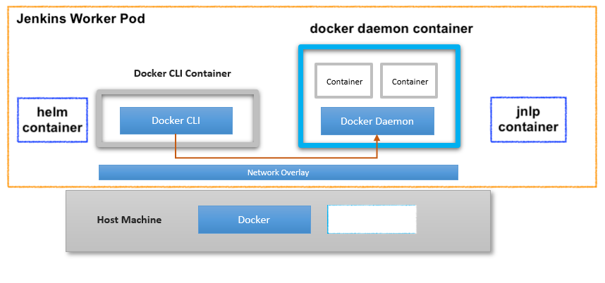
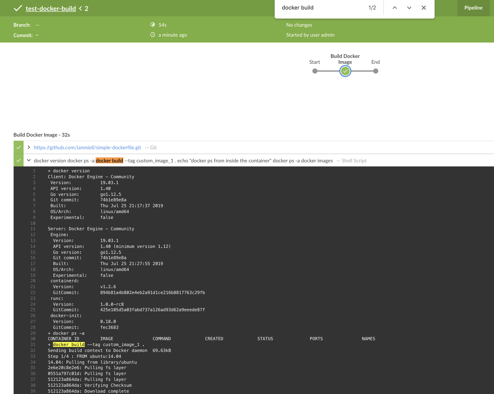

# 8. How to Build Docker Image inside Jenkins Slave Pod (DinD: Docker in Docker scenario)

Jenkins CI/CD pipeline flow would be something like:
- git pull
- build docker image (npm install, npm test, gulp build)
- test docker image locally
- push docker image to registry (e.g. AWS ECR)
- package new helm chart
- push helm chart to private helm repo (e.g. AWS S3)
- deploy helm chart to K8s cluster (helm upgrade --set image.tag=NEW_TAG)


## 8.1 Build Docker Image inside Docker Container (DinD)
Ref: https://github.com/jenkinsci/kubernetes-plugin/blob/master/examples/dind.groovy

Building docker image inside Jenkins worker pod means __Docker in Docker (DinD)__ situation (i.e. docker image is built inside docker daemon container). 

DinD:


DooD:


Inside Jenkins's worker pod, there is `jnlp-slave` container which runs a jenkins job/pipeline. 

And we want to run `docker build` command, but `jnlp-slave` container doesn't have docker inside.

For this to happen, docker needs to be installed and accessible from within jnlp-slave container. 

We will define a pod YAML with multiple containers including `docker` for docker client, `docker-daemon` for docker server.




[Jenkinsfile.build.docker](Jenkinsfile.build.docker):
```groovy
pipeline {
    agent {
        kubernetes {
            yaml '''
apiVersion: v1
kind: Pod  # <-------- pod where jenkins slave agent container (jnlp-slave) will be running
spec:
  serviceAccountName: jenkins # this is for IRSA (IAM role for service account)
  containers:
  - name: docker # <---------- docker client
    image: docker:19.03.1
    command:
    - sleep
    args:
    - 99d
    env:
      - name: DOCKER_HOST
        value: tcp://localhost:2375
  - name: docker-daemon
    image: docker:19.03.1-dind # <-------- special image tag
    securityContext:
      privileged: true
    env:
      - name: DOCKER_TLS_CERTDIR
        value: ""
'''
            defaultContainer 'docker'
        }
    }

    stages {
        stage('Build Docker Image') {
            steps {
                 git url: 'https://github.com/ianmiell/simple-dockerfile.git'
                    
                container('docker') {  // <-- specify which container in the pod YAML to run below as a host container
                    sh '''
                        docker version
                        docker ps -a
                        docker build --tag custom_image_1 .

                        echo "docker ps from inside the container"
                        docker ps -a
                        docker images
                    '''
                } // container
            } // steps
        } // stage
    } // stages
} // pipeline
```


