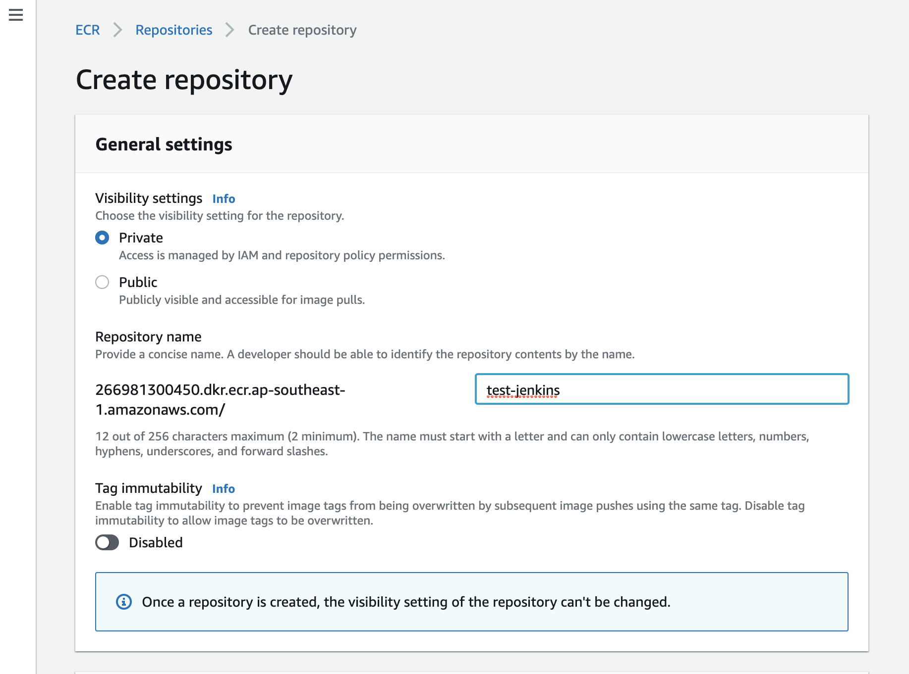
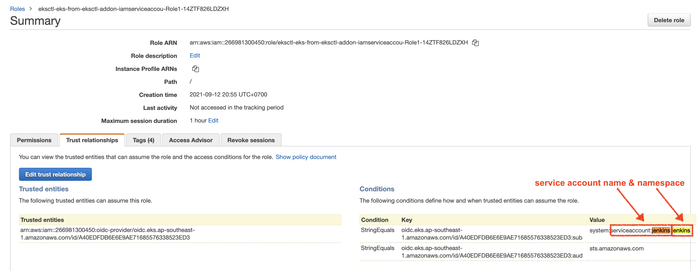

# 9. How to Push Docker Image to AWS ECR from K8s Pod

First create AWS ECR repo called `test-jenkins` from AWS Console



To push docker image after `docker build`, you would run these commands usually
```sh
docker build 
docker tag 

# login to private docker registry
ecr_password=$(aws ecr get-login-password ...)
docker login
docker push ...
```

This means, Jenkinsfile `steps {}` need to be running inside a container which has both `docker` and `aws` CLI.

Hence we need to __bake a custom docker image__ to host such a jenkins step (same for when we want to use `kubectl`, `helm`, and `git` CLI).


First, create `Dockerfile.docker.aws`:
```dockerfile
FROM docker:19.03.1
RUN apk add --no-cache \
        python3 \
        py3-pip \
    && pip3 install --upgrade pip \
    && pip3 install \
        awscli \
    && rm -rf /var/cache/apk/*

# make sure to let it sleep otherwise docker container exists right away
CMD ["sleep", "99d"]

# USAGE
# build
# docker build --no-cache -t docker-aws -f Dockerfile.docker.aws .

# test docker and aws CLI are installed
# docker run --rm -d --name docker-aws docker-aws:latest /bin/sh -c "sleep 500"
# docker exec -it docker-aws aws

# push to your private docker registry (dockerhub or AWS ECR)
# docker tag docker-aws xxxx.dkr.ecr.REGION.amazonaws.com/ecr-jenkins:docker-aws
# docker push xxxx.dkr.ecr.REGION.amazonaws.com/ecr-jenkins:docker-aws
```


Build and push a docker image to AWS ECR.
```sh
docker build --no-cache -t docker-aws -f Dockerfile.docker.aws .

docker run --rm -d --name docker-aws docker-aws:latest /bin/sh -c "sleep 500"

# check aws and docker CLIs are installed inside docker-aws container
docker exec -it docker-aws aws
docker exec -it docker-aws docker

docker stop docker-aws

# change this to your own
ECR_REPO_URI="266981300450.dkr.ecr.ap-southeast-1.amazonaws.com/test-jenkins"
docker tag docker-aws ${ECR_REPO_URI}:docker-aws

# get ECR password
ecr_password=$(aws ecr get-login-password --region ${AWS_REGION})

# login to ecr repo using docker login
echo ${ecr_password} | docker login \
                                  --username AWS \
                                  --password-stdin \
                                  ${ECR_REPO_URI}
# output
Login Succeeded

docker push ${ECR_REPO_URI}:docker-aws
```


Then update Jenkinsfile by adding a `docker-aws` docker image in Kubernetes agent yaml config:

[Jenkinsfile.push.docker.insecure](Jenkinsfile.push.docker.insecure):
```groovy
pipeline {
    agent {
        kubernetes {
            yaml '''
apiVersion: v1
kind: Pod  # <-------- pod where jenkins slave agent container (jnlp-slave) will be running
spec:
  serviceAccountName: jenkins # this is for IRSA (IAM role for service account)
  containers:
  - name: docker # <---------- docker client
    image: docker:19.03.1
    command:
    - sleep
    args:
    - 99d
    env:
      - name: DOCKER_HOST
        value: tcp://localhost:2375
  - name: docker-aws-cli # <----------- add new docker image name
    image: 266981300450.dkr.ecr.ap-southeast-1.amazonaws.com/test-jenkins:docker-aws # <----- docker image you pushed to ECR
    env:
      - name: DOCKER_HOST
        value: tcp://localhost:2375
  - name: docker-daemon
    image: docker:19.03.1-dind # <-------- special image tag
    securityContext:
      privileged: true
    env:
      - name: DOCKER_TLS_CERTDIR
        value: ""
'''
            defaultContainer 'docker'
        }
    }

    environment {
      ECR_REPO_URI = "266981300450.dkr.ecr.ap-southeast-1.amazonaws.com/test-jenkins"
      AWS_REGION = "ap-southeast-1"
    }

    stages {
        stage('Build Docker Image') {
            steps {
                 git url: 'https://github.com/ianmiell/simple-dockerfile.git'
                    
                container('docker') {  // <-- specify which container in the pod YAML to run below as a host container
                    sh '''
                        docker version
                        docker ps -a
                        docker build --tag custom_image_1 .

                        echo "docker ps from inside the container"
                        docker ps -a
                        docker images
                    '''
                } // container
            } // steps
        } // stage

        stage('Push Docker Image') {
            steps {
                 git url: 'https://github.com/ianmiell/simple-dockerfile.git'
                    
                container('docker-aws-cli') {  // <-- specify which container in the pod YAML to run below as a host container
                    sh '''
                        docker version
                        docker images

                        docker tag custom_image_1 ${ECR_REPO_URI}:custom_image_1

                        # get ECR password
                        ecr_password=$(aws ecr get-login-password --region ${AWS_REGION})

                        # login to ecr repo using docker login
                        echo ${ecr_password} | docker login \
                                                          --username AWS \
                                                          --password-stdin \
                                                          ${ECR_REPO_URI}

                        # push
                        docker push ${ECR_REPO_URI}:custom_image_1
                    '''
                } // container
            } // steps
        } // stage
    } // stages
} // pipeline
```


Then docker push from Jenkins-slave pod fails.


If you look at EKS worker node's instance profile's IAM policies, there is only read permissions to ECR.


So we need to add write permissions to ECR to either:
- worker node's instance profile, which you already know is not best practice as it's breaking the __principle of least priviledge__ (from my AWS EKS Handson course), or
- Jenkins-slave pod via __IRSA__ (IAM Role for Service Account, basically pod-level AWS IAM permissions).


So we will implement IRSA for jenkins-slave pod.


But before that, let's fix a security issue where Jenkins pipeline printing out and storing ECR password to console and logs:


## 9.2 How to Hide Sensitive Information From Jenkins Logs and Shell

Simply disable __shell option__ `xtrace` by `set +x`.

`xtrace` option prints commands after expansion as they execute.
You can see shell options value by running `set -o`.

Disable variable value exapnsion 
```sh
# hide AWS creds from console
set +x
set -o verbose
```

Enable variable value exapnsion 
```sh
# enbale back
set -o xtrace
set +v
```

[Jenkinsfile.push.docker.secure](Jenkinsfile.push.docker.secure):
```groovy
pipeline {
    agent {
        kubernetes {
            yaml '''
apiVersion: v1
kind: Pod  # <-------- pod where jenkins slave agent container (jnlp-slave) will be running
spec:
  serviceAccountName: jenkins # this is for IRSA (IAM role for service account)
  containers:
  - name: docker # <---------- docker client
    image: docker:19.03.1
    command:
    - sleep
    args:
    - 99d
    env:
      - name: DOCKER_HOST
        value: tcp://localhost:2375
  - name: docker-aws-cli # <----------- add new docker image name
    image: 266981300450.dkr.ecr.ap-southeast-1.amazonaws.com/test-jenkins:docker-aws # <----- docker image you pushed to ECR
    env:
      - name: DOCKER_HOST
        value: tcp://localhost:2375
  - name: docker-daemon
    image: docker:19.03.1-dind # <-------- special image tag
    securityContext:
      privileged: true
    env:
      - name: DOCKER_TLS_CERTDIR
        value: ""
'''
            defaultContainer 'docker'
        }
    }

    environment {
      ECR_REPO_URI = "266981300450.dkr.ecr.ap-southeast-1.amazonaws.com/test-jenkins"
      AWS_REGION = "ap-southeast-1"
    }

    stages {
        stage('Build Docker Image') {
            steps {
                 git url: 'https://github.com/ianmiell/simple-dockerfile.git'
                    
                container('docker') {  // <-- specify which container in the pod YAML to run below as a host container
                    sh '''
                        docker version
                        docker ps -a
                        docker build --tag custom_image_1 .

                        echo "docker ps from inside the container"
                        docker ps -a
                        docker images
                    '''
                } // container
            } // steps
        } // stage

        stage('Push Docker Image') {
            steps {
                 git url: 'https://github.com/ianmiell/simple-dockerfile.git'
                    
                container('docker-aws-cli') {  // <-- specify which container in the pod YAML to run below as a host container
                    sh '''
                        docker version
                        docker images

                        docker tag custom_image_1 ${ECR_REPO_URI}:custom_image_1

                        # hide AWS creds from console
                        set +x   # <-------------------- here
                        set -o verbose

                        # get ECR password
                        ecr_password=$(aws ecr get-login-password --region ${AWS_REGION})

                        # login to ecr repo using docker login
                        echo ${ecr_password} | docker login \
                                                          --username AWS \
                                                          --password-stdin \
                                                          ${ECR_REPO_URI}

                        # enbale back
                        set -o xtrace
                        set +v

                        # push
                        docker push ${ECR_REPO_URI}:custom_image_1
                    '''
                } // container
            } // steps
        } // stage
    } // stages
} // pipeline
```

Now password isn't printed out nor stored in jenkins logs.


## 9.3 How to Give Jenkins Slave Pod AWS IAM permissions so it can push docker image to AWS ECR


Since our EKS cluster is using IRSA (IAM role for service account), jenkins IAM assumable role should be created by terraform (my other course  `Advanced Terraform with AWS EKS + VPC`).


But since we aren't using Terraform in this course, let's use CLI to create IAM role and service account.

Consumer of the IAM role is jenkins-slave pod in `jenkins` namespace, so service account must be created in `jenkins` namespace as well.
```sh
# set region to yours
AWS_REGION="ap-southeast-1"
CLUSTER_NAME="eks-from-eksctl"

# create k8s service account and IAM role
# we can use AWS managed IAM policy "AmazonEC2ContainerRegistryPowerUser"
eksctl create iamserviceaccount \
    --name jenkins \
    --namespace jenkins \
    --cluster ${CLUSTER_NAME} \
    --attach-policy-arn arn:aws:iam::aws:policy/AmazonEC2ContainerRegistryPowerUser \
    --approve \
    --override-existing-serviceaccounts \
    --region ${AWS_REGION}
```


Check IAM role created:



Since the default Jenkins's helm values.yaml (fetched by `helm show values jenkins/jenkins`) shows that it'll create a service account, need to overwrite `serviceAccount.create=false`
```yaml
serviceAccount:
  create: true # <----- default value
  # The name of the service account is autogenerated by default
  name:
  annotations: {}
  imagePullSecretName:
```


Edit Jenkins `overrides.yaml` to use the existing service account name `jenkins`, and add IAM role ARN as annotations
```yaml
controller:
  # use Docker in Docker jenkins, so that jenkins container can build docker image inside
  statefulSetLabels:
    app: jenkins  # needed for istio
    version: 2.0.0  # needed for istio
  serviceLabels:
    app: jenkins  # needed for istio
    version: 2.0.0  # needed for istio
  podLabels:
    app: jenkins  # needed for istio
    version: 2.0.0  # needed for istio
  JCasC:
    defaultConfig: false # need to disable this otherwise existing plugins and pipeline jobs won't be loaded and you will face "SEVERE	jenkins.InitReactorRunner$1#onTaskFailed: Failed Loading plugin" and "WARNING	c.c.h.p.folder.AbstractFolder#loadChildren:
serviceAccount:
  name: jenkins # <----- 
  create: false # <----- make sure to overwrite this
  # for Jenkins pod to assume IAM role (IRSA)
  annotations: 
    eks.amazonaws.com/role-arn: "arn:aws:iam::266981300450:role/eksctl-eks-from-eksctl-addon-iamserviceaccou-Role1-14ZTF826LDZXH" # <----- change this to your IAM role ARN

persistence:
  existingClaim: efs-jenkins-claim
  storageClass: efs-sc
```


Finally, upgrade jenkins helm chart
```sh
# save YAML to file
helm upgrade jenkins jenkins/jenkins \
    -n jenkins \
    -f overrides.yaml
```


Make sure `jenkins` service account is created in `jenkins` namespace, and has annotations for the AWS IAM role ARN.
```sh
$ kubectl get sa jenkins -n jenkins -o yaml

apiVersion: v1
kind: ServiceAccount
metadata:
  annotations:
    eks.amazonaws.com/role-arn: arn:aws:iam::266981300450:role/eksctl-eks-from-eksctl-addon-iamserviceaccou-Role1-14ZT  # <------ the IAM role ARN
```


Re-run the pipeline, then Jenkins-slave pod will be launched, so `kubectl describe pod` to see if the IAM role and AWS web token are injected into container as ENVs
```sh
$ kubectl describe po -n jenkins test-push-docker-7-g2xkn-65b2v-qrhrs
Name:         test-push-docker-7-g2xkn-65b2v-qrhrs
Namespace:    jenkins

Containers:
  docker:
    ...
  docker-aws-cli:
    Container ID:   docker://385e9203c5105d9477603cd7fce246a3442334dbe10acf7ee2b9314403f58307
    Image:          266981300450.dkr.ecr.ap-southeast-1.amazonaws.com/test-jenkins:docker-aws
    Environment:
      DOCKER_HOST:                  tcp://localhost:2375
      AWS_DEFAULT_REGION:           ap-southeast-1
      AWS_REGION:                   ap-southeast-1
      AWS_ROLE_ARN:                 arn:aws:iam::266981300450:role/eksctl-eks-from-eksctl-addon-iamserviceaccou-Role1-14ZTF826LDZXH # <----- the IAM role ARN is injected to container
      AWS_WEB_IDENTITY_TOKEN_FILE:  /var/run/secrets/eks.amazonaws.com/serviceaccount/token # <---- JWT token to be used by "aws sts assume-role-with-web-identity --role-arn xxx --web-identity-token yyy"
    Mounts:
      /home/jenkins/agent from workspace-volume (rw)
      /var/run/secrets/eks.amazonaws.com/serviceaccount from aws-iam-token (ro) # <-----
      /var/run/secrets/kubernetes.io/serviceaccount from kube-api-access-kqqdg (ro)
  docker-daemon:
    ...
  jnlp:
    ...
Conditions:
Volumes:
  aws-iam-token:  # <-----
    Type:                    Projected (a volume that contains injected data from multiple sources)
    TokenExpirationSeconds:  86400
```


And the pipeline job succeed:


